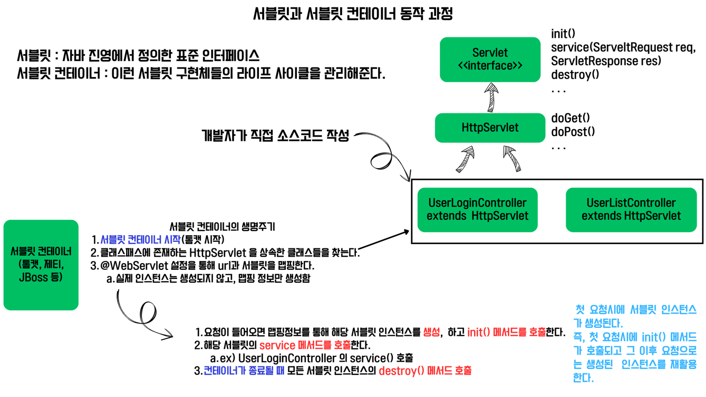

# 웹 애플리케이션 & MVC 프레임워크 구현 저장소

- [자바 웹 프로그래밍 Next Step(박재성님)](https://product.kyobobook.co.kr/detail/S000001624682) 책을 보며 학습합니다.

---
## 🌱 새로 알게된 학습 내용 [WebApplication]

<details>
    <summary> [요구사항 1] - java I/O </summary>


- 스트림 : 자바의 입/출력을 담당
  - 입력 : 네트워크, 파일읽기, 키보드
  - 출력 : 네트워크, 파일쓰기, 모니터
- 바이트 스트림 / 문자 스트림 
  - 바이트 스트림
    - InputStream, OutputStream
  - 문자 스트림
    - Reader, Writer
  - write를 할 byte보다는 byte[]를 보내서 한번의 I/O작업으로 많은 데이터를 보내도록 해야 유리하다.
  - 스트림 사용 후에는 메모리에서 자원을 해제하자.(try-with-resources 구문 유용(java 9이상))
    - 왜? 스트림을 장시간 열어놓으면 파일, 포트 등의 리소스에서 누수(leak)이 발생할 수 있다.
      - 파일, 포트를 점유중이면, 다른곳에서 점유해서 사용할 수가 없음.
      - 동시 열 수 있는 파일 수 폭은 포트 수 로 인해 영향을 미칠 수 있음.

- 실습에서 InputStream을 "문자" 형식으로 읽기 위해 Reader로 변환하였다.
  - 어떻게?
  - 보조 스트림 : 다른 스트림과 연결되어 편리한 기능 제공
    - 아래는 InputStreamReader라는 보조스트림을 사용하고 있음.
    - 네트워크소켓 -> InputStream -> InputStreamReader -> Reader -> 프로그램
    ```java
    BufferedReader br = new BufferedReader(new InputStreamReader(in, StandardCharsets.UTF_8));
    ```
  - BufferedReader : 커널영역의 버퍼를 사용하여 입력 성능을 향상시킨다.
    - 버퍼 크기를 지정하지 않으면 기본 크기는 8KB
    - 문자를 행 단위로 읽을 수 있도록 메서드도 제공해줌(장점)
  - 어떻게?
    - 프로그램과 입/출력 소스 사이에 버퍼를 둔다.
    - 프로그램은 입/출력과의 상호작용이 아니라, 메모리상의 버퍼라는 중간자와 작업하여 실행 성능을 높인다.
    - 버퍼에 일정량의 데이터가 쌓이면, 한번에 입력받거나 출력해서 성능을 향상 시킨다.
      - 버퍼에 쓰는 작업이 속도가 빠름.
      - 잦은 I/O보다 많은 데이터로 한번의 I/O가 성능에 유리.
    - 버퍼를사용할 경우에는 마지막에 flush()를 통해 버퍼에 남아있는 내용을 전송해주자.
      - 왜? 스트림은 동기(synchronous)로 동작하므로, 버퍼가 찰때까지 대기하게 되고, 데드락 상태가 될 수 있다.
      - 즉, 마지막 남은 데이터를 버퍼에서 전부 강제로 전송함으로써, 버퍼를 비우고 대기(동기방식) 상태에서 빠져나와야 한다.

</details>

<details>
    <summary> [요구사항 1] - File, ClassLoader </summary>

- Files : 파일과 디렉토리 정보를 가지고 있다.(vs File 보다 조금 더 많은 기능을 제공해줌)
    - 정적 메서드로 구성되어있고, "운영체제 파일 시스템"에게 작업을 수행하도록 "위임".
- ClassLoader : JVM이 메모리에 객체를 로드하기위해 사용하는 클래스로더 객체
  - getResource() 메서드를 보면 부모가 있으면 재귀적으로 최상위 부모의 url을 찾아낸다.
  - 최상위 부모 url을 찾았다면, BootLoader.findResource(name); 로 해당 파일의 url을 찾아낸다.
    - 결국 특정 경로의 파일을 찾아내는 과정은 ClassLoader 에게 위임한다.
  - 찾은 url경로를 통해 File, Files 를 사용해 파일을 찾을 수 있다.

</details>

<details>
    <summary> [요구사항 3] - 슬래시(/) 절대경로</summary>

- "Location: /user/login.html \r\n"
  - 경로의 맨 앞에 슬래시(/)를 붙여주면 절대경로로 동작한다.
- "Location: user/login.html \r\n"
  - 경로의 맨 앞에 슬래시를 붙여주지 않으면 상대경로로 동작한다.
  - ex) localhost:8080/user/login.html 에서 상대경로로 이동하면 localhost:8080/user/user/login.html 이 된다.
- html 의 \<a> 태그의 src 에서도 슬래시(/)가 있어야 절대경로로 동작한다.
  - \<a href="/user/login.html" role="button">로그인 페이지\</a>

</details>

<details>
    <summary> [요구사항 5] - css</summary>

- <link rel="stylesheet" href="/css/styles.css"> 는 현재 html 에 적용할 css 파일을 요청하는 링크이다.
- html 파일을 불러오면 브라우저가 GET / localhost:8080/css/styles.css 로 css 파일도 받아온다.
    - 개발자 도구를 확인하면 index.html 과 styles.css 파일을 받아오기 위해 2번의 네트워크 통신이 이루어졌다.

</details>

<details>
    <summary> 서블릿과 서블릿 컨테이너</summary></summary>

- 서블릿 : 앞에서 구현한 요청/응답에 대한 모든 것을 추상화 시켜놓은 인터페이스
- 서블릿 컨테이너 : 서블릿 객체에 대해 생성, 초기화, 호출, 종료 의 라이프사이클을 관리해준다.
  - 서블릿 컨테이너의 대표적인 예시로 Tomcat 이 있다.



</details>

<details>
    <summary> [요구사항 6] 톰캣 구조로 개선</summary>

- 톰캣 안에는 catalina 와 coyote 가 존재한다.
- catalina
  - 톰캣에서 서블릿 컨테이너 역할을 수행한다.
  - 즉, coyote의 커넥터로부터 받은 모든 요청을 받고 응답해주는 역할을 수행한다.
- coyote
  - HTTP 1.1 과 2를 웹서버로 지원하는 톰캣용 커넥터이다.
  - 즉, 클라이언트와 실제 통신 처리를 담당한다.

</details>

<details>
    <summary> [요구사항 7] 세션 저장소 </summary>

- 쿠키 : Set-Cooke 를 통해 상태를 유지할 수 있다.
  - 그러나 브라우저에서 쿠키값을 확인하거나 조작할 수 있으므로, 보안상 취약하다.
  - 즉, 쿠키로 중요한 개인정보를 전달하는 행위는 위험할 수 있다.
- 세션 : 쿠키의 단점을 보안하기위해 상태값을 브라우저가 아닌 "서버" 에 저장한다.
  - 클라이언트마다 "고유한 아이디"를 발급하고 Set-Cookie 헤더를 통해 전달한다.
  - 세션은 상태를 저장만 하고, 클라이언트에게 전달할 때에는 결국 쿠키를 이용한다.

</details>

---
## WebApplication 만들기 요구사항

### 웹 서버 구현
1. http://localhost:8080/index.html GET 요청 시, webapp디렉토리의 index.html 파일을 응답한다.
2. http://localhost:8080/user/form.html GET 요청 시, webapp/user 디렉토리의 form.html 파일을 응답한다.
   - form.html 파일안에서 POST로 회원가입 요청을 한다.(POST user/create)
   - 회원가입 요청에 성공하면 302 상태코드를 응답하고, index.html 파일로 이동한다.
3. http://localhost:8080/user/login.html GET 요청 시, webapp/user 디렉토리의 login.html 파일을 응답한다.
   - login.html 파일안에서 POST로 로그인 요청을 한다.(POST user/login)
   - 로그인에 실패하면 login_failed.html 파일로 이동한다.
   - 응답헤더에 쿠키를 활용해 logined=true(로그인 성공 여부)를 추가한다.
   - 로그인기능을 위해 로컬 저장소(DataBase)에 저장한다.
4. http://localhost:8080/user/list GET 요청 시, 동적으로 생성한 html 을 응답으로 보낸다.
   - 로그인하지 않은 상태라면 로그인 페이지(login.html)로 이동한다.
5. css 파일을 지원한다 지원한다.
    - http://localhost:8080/css/styles.css GET 요청시, .css 를 응답해준다.
6. 톰캣 구조로 개선해보자.
   - catalina 와 coyote 패키지로 나누고, 각 역할에 맞게 구조를 분리해보자.
7. 세션 저장소 구현
   - 로그인시 세션 저장소에 로그인 정보를 남기도록 개선하자.
     - 쿠키는 브라우저에서 조작이 가능하기 때문에, 쿠키만으로 로그인 유/무를 판단할 순 없다.

### 웹 서버 리팩토링 하기
1. HttpRequest & HttpResponse 를 활용하여 요청 데이터 처리와 응답 데이터 처리의 책임을 분리한다.
2. 다형성을 활용하여 클라이언트 요청 URL 에 대한 분기 처리를 제거한다
   - Controller 인터페이스와 AbstractController 추상클래스를 활용해 분기문을 분리한다.
   - Map<String, Controller> controllers 를 통해 url 에대한 Controller 구체 클래스들을 맵핑한다.


---
## 🌱 새로 알게된 학습 내용 [MVC 프레임워크]
<details>
    <summary> [요구사항 1] - @WebServlet 어노테이션 </summary>

```java
@WebServlet(name = "dispatcher", urlPatterns = "/", loadOnStartup = 1)
public class DispatcherServlet extends HttpServlet {

    private static final Logger log = LoggerFactory.getLogger(DispatcherServlet.class);

    @Override
    protected void service(HttpServletRequest request, HttpServletResponse response) throws IOException {
        log.info("DispatcherServlet->service()");
    }
}
```
- urlPatterns 를 "/"로 설정해서 모든 요청이 이 서블릿으로 들어오도록 한다.
  - 즉, 여기서 DispatcherServlet 은 어떤 요청이든 전부 받아들여서 service() 메서드를 호출한다.
- loadOnStartup 은 뭘까?
  - 정수값을 가지며 서블릿 초기화 순서를 나타낸다.(숫자가 낮을수록 먼저 초기화 된다)
  - 만약 지정해주지 않으면 첫 요청이 들어올 때 초기화 되어버린다.
    - 첫 요청시 서블릿이 초기화 되는 비용으로 인해 속도가 느려질 수 도 있다.(그래서 미리 초기화하는 것)

</details>

<details>
    <summary> [요구사항 1] - forward 방식와 redirect 방식 </summary>

- 리다이렉트 경로로 요청이 들어오면 2가지 방식으로 처리하는 방법을 생각해볼 수 있다.
  - redirect : 클라이언트(브라우저)에게 302 응답과 Location(리다이렉트할 url) 정보를 응답해주고, 새로운 경로로 요청을 유도한다.
    - 이 경우 브라우저는 302 응답을 받고 곧바로 서버에게 새로운 경로로 요청을 보낸다.
    - 새롭게 요청을 보내기 때문에 브라우저의 주소창이 새로운 리다이렉트 경로로 변경된다.
  - forward : 서버내부에서 리다이렉트 경로를 찾아내고 곧바로 리다이렉트 경로로 서블릿에게 요청하거나 뷰를 반환한다.
    - 이 경우에는 브라우저상의 요청 주소값이 리다이렉트된 값으로 변경되지 않는다.
</details>

<details>
    <summary> [요구사항 2] - 톰캣 초기화 과정 </summary>

1. 톰캣 실행시 ServletContext 객체 초기화(jakarta.servlet.ServletContext) → 컨텍스트 리스너의 contextInitialized 메서드 호출
    - ServletContextListener(인터페이스)를 구현한다.
    - @WebListener : 서블릿 컨텍스트가 Listener 클래스라고 인식할 수 있게 해준다.
    - 톰캣 시작 직후 실행되고 초기값 혹은 초기 설정을 정의하는데 사용할 수 있고, 디스패처 서블릿보다 먼저 동작한다.

    ```java
    @WebListener
    public class ContextLoaderListener implements ServletContextListener {
    
        private static final Logger log = LoggerFactory.getLogger(ContextLoaderListener.class);
    
        @Override
        public void contextInitialized(ServletContextEvent sce) {
            log.info("Tomcat init");
    
            ThymeleafConfig.initialize();
        }
    
        @Override
        public void contextDestroyed(ServletContextEvent sce) {
            log.info("Tomcat stopped successfully");
        }
    }
    
    ```

2. 디스페처 서블릿 초기화 메서드를 실행한다. (loadOnStartup을 1로 설정했기 때문 → 설정 안하면 최초 요청할 때 생성됨.)
3. 디스페처 초기화시 RequestMapping 인스턴스 생성 및 초기화

</details>

<details>
    <summary> [요구사항 2] - 톰캣 시작 후 요청시 순서 </summary>

1. 디스패처 서블릿 전에 Filter 를 구현한 doFilter() 메서드를 호출한다.
   - 아래에는 정적 파일의 경우 디스페처 서블릿으로 보내지 않고,  서블릿 컨텍스트의 default라는 기본 디스페처에 forward 해버린다.
   - 이 경우 기본 경로로 설정한 webapps 안에서 해당 리소스를 찾아서 응답해주게 된다.
    ```java
    @WebFilter("/*")
    public class ResourceFilter implements Filter {
    
        private static final Logger log = LoggerFactory.getLogger(ResourceFilter.class);
        private static final List<String> resourcePrefixs = new ArrayList<>();
    
        static {
            resourcePrefixs.add("/css");
            resourcePrefixs.add("/js");
            resourcePrefixs.add("/fonts");
            resourcePrefixs.add("/images");
            resourcePrefixs.add("/favicon.ico");
        }
    
        private RequestDispatcher defaultRequestDispatcher;
    
        @Override
        public void init(FilterConfig filterConfig) throws ServletException {
            log.info("ResourceFilter init");
            this.defaultRequestDispatcher = filterConfig.getServletContext().getNamedDispatcher("default");
        }
    
        @Override
        public void doFilter(ServletRequest servletRequest, ServletResponse servletResponse, FilterChain filterChain) throws IOException, ServletException {
            HttpServletRequest req = (HttpServletRequest) servletRequest;
            String path = req.getRequestURI().substring(req.getContextPath().length());
            if (isResourceUrl(path)) {
                log.info("request static resource : {}", path);
                defaultRequestDispatcher.forward(servletRequest, servletResponse);
                return;
            }
    
            filterChain.doFilter(servletRequest, servletResponse);
        }
    
        @Override
        public void destroy() {
            log.info("ResourceFilter destroy");
        }
    
        private boolean isResourceUrl(String url) {
            return resourcePrefixs.stream()
                    .anyMatch(url::startsWith);
        }
    
    }
    ```
2. “/’로 설정된 디스페처 서블릿의 service() 메서드가 실행된다.
3. service()에서 각 요청 URL에 해당하는 Controller 타입 객체를 받는다.(RequestMapping 을 통해 가져옴)
4. Controller의 execute() 메서드를 실행하고, ModelAndView를 반환받는다.
5. ModelAndView에서 view와 model을 꺼내고, view.render() 메서드에 model을 넘겨준다.
   - 내부적으로 render는 jsonView, ThymeleafView에 따라 적절히 응답한다.


</details>

<details>
    <summary> [요구사항 2] - 멀티쓰레드 환경에서의 상태값 동시성 문제를 고려하자 </summary>

- 아래의 코드에서 ShowController는 디스페처 서블릿이 인스턴스를 단 1개만 만든다.
- 하지만 실제 여러 쓰레드의 요청이 들어와 execute()를 실행하면서 필드에 경쟁상태 발생한다.
```java
public class ShowController extends AbstractController {
    private QuestionDao questionDao = new QuestionDao();
    private AnswerDao answerDao = new AnswerDao();
    private Question question;
    private List<Answer> answers;

    @Override
    public ModelAndView execute(HttpServletRequest req, HttpServletResponse response) throws Exception {
        Long questionId = Long.parseLong(req.getParameter("questionId"));

        question = questionDao.findById(questionId);
        answers = answerDao.findAllByQuestionId(questionId);

        ModelAndView mav = jspView("/qna/show.jsp");
        mav.addObject("question", question);
        mav.addObject("answers", answers);
        return mav;
    }
}
```

```java
public class ShowController extends AbstractController {
    private QuestionDao questionDao = new QuestionDao();
    private AnswerDao answerDao = new AnswerDao();

    @Override
    public ModelAndView execute(HttpServletRequest req, HttpServletResponse response) throws Exception {
        Long questionId = Long.parseLong(req.getParameter("questionId"));

        private Question question = questionDao.findById(questionId);
        private List<Answer> answers = answerDao.findAllByQuestionId(questionId);

        ModelAndView mav = jspView("/qna/show.jsp");
        mav.addObject("question", question);
        mav.addObject("answers", answers);
        return mav;
    }
}
```
- 클래스 필드가 상태값을 가진다면 동시성을 항상 주의해야한다.
  - 상태값을 가지지 않는다면? 싱글톤클래스로 관리하면 효율적이다.
  - ex) JdbcTemplate, ShowController, Repository 등
- 결국 스프링 프레임워크에서 Bean으로 관리하는 객체들이 모두 싱글톤인 이유가 바로 이것이다.(상태값을 가지지 않는 공통 사용 클래스들)

</details>


---

## MVC 프레임워크 만들기 요구사항
1. 프론트 컨트롤러 패턴을 활용하여 MVC 구조 만들기 
   - 서블릿으로 디스패처 서블릿 만들기
   - Controller 를 추상화시키고, RequestMapping 을 활용하여 알맞은 컨트롤러로 동작하도록 한다.
2. 텔플릿(view) 외에 Json 데이터도 응답할 수 있도록 개선
   - View 인터페이스를 활용(ThyemleafView, JsonView)
   - ModelAndView 를 활용한 추상화